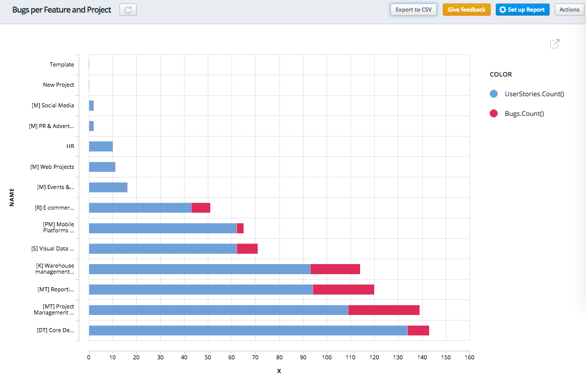
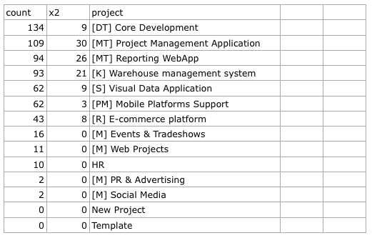

Export Report To CSV
================================

The mashup allows to export data from the created custom graphical reports and get the information represented in a tabular form.

For example, we have a report which shows how many bugs and user stories are in every project:



When you export such a report into .csv file, you'll see the project names and user stories and bugs count shown as columns in the file.



How To Install The Mashup
----------------------------------------

1. Navigate to ```Settings > (System Settings) > Mashups```
2. Find 'Export Report To CSV' mashup in the Mashups Library
3. Click Install button
4. A new 'Export to csv' button will appear on Report Views


Note: The mashup is a prototype for future core functionalily, so any feedback is highly appreciated.
